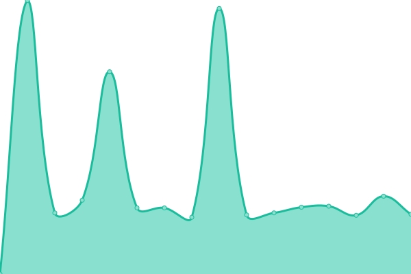

# [📈 Live Status](https://jpleasants.github.io/plesk8): <!--live status--> **🟩 All systems operational**

This repository contains the open-source uptime monitor and status page for [jpleasants](https://jpleasants.github.io/plesk8), powered by [Upptime](https://github.com/upptime/upptime).

With [Upptime](https://upptime.js.org), you can get your own unlimited and free uptime monitor and status page, powered entirely by a GitHub repository. We use [Issues](https://github.com/jpleasants/plesk8/issues) as incident reports, [Actions](https://github.com/jpleasants/plesk8/actions) as uptime monitors, and [Pages](https://jpleasants.github.io/plesk8) for the status page.

<!--start: status pages-->
<!-- This summary is generated by Upptime (https://github.com/upptime/upptime) -->
<!-- Do not edit this manually, your changes will be overwritten -->
<!-- prettier-ignore -->
| URL | Status | History | Response Time | Uptime |
| --- | ------ | ------- | ------------- | ------ |
|  [Plesk 8](https://plesk8.samitsolutions.com) | 🟩 Up | [plesk-8.yml](https://github.com/jpleasants/plesk8/commits/HEAD/history/plesk-8.yml) | 

 848ms
     
 | 

<a href="https://jpleasants.github.io/plesk8/history/plesk-8">94.35%</a>
    

|  [beta-search](https://beta-search.com) | 🟩 Up | [beta-search.yml](https://github.com/jpleasants/plesk8/commits/HEAD/history/beta-search.yml) | 

 717ms
     
 | 

<a href="https://jpleasants.github.io/plesk8/history/beta-search">94.34%</a>
    

|  [executiveeatsnyc](https://executiveeatsnyc.com) | 🟩 Up | [executiveeatsnyc.yml](https://github.com/jpleasants/plesk8/commits/HEAD/history/executiveeatsnyc.yml) | 

 686ms
     
 | 

<a href="https://jpleasants.github.io/plesk8/history/executiveeatsnyc">94.34%</a>
    

|  [gardenroaddistributors](https://gardenroaddistributors.com) | 🟩 Up | [gardenroaddistributors.yml](https://github.com/jpleasants/plesk8/commits/HEAD/history/gardenroaddistributors.yml) | 

 949ms
     
 | 

<a href="https://jpleasants.github.io/plesk8/history/gardenroaddistributors">94.35%</a>
    

|  [midwestsleepmedicine](https://midwestsleepmedicine.com) | 🟩 Up | [midwestsleepmedicine.yml](https://github.com/jpleasants/plesk8/commits/HEAD/history/midwestsleepmedicine.yml) | 

 644ms
     
 | 

<a href="https://jpleasants.github.io/plesk8/history/midwestsleepmedicine">94.35%</a>
    

|  [Sixth Sense HI](https://sixthsensehi.com) | 🟩 Up | [sixth-sense-hi.yml](https://github.com/jpleasants/plesk8/commits/HEAD/history/sixth-sense-hi.yml) | 

 649ms
     
 | 

<a href="https://jpleasants.github.io/plesk8/history/sixth-sense-hi">94.34%</a>
    

|  [ourhealthpartner](https://ourhealthpartner.com) | 🟩 Up | [ourhealthpartner.yml](https://github.com/jpleasants/plesk8/commits/HEAD/history/ourhealthpartner.yml) | 

 1378ms
     
 | 

<a href="https://jpleasants.github.io/plesk8/history/ourhealthpartner">94.33%</a>
    

|  [rangolicatering](https://rangolicatering.com) | 🟩 Up | [rangolicatering.yml](https://github.com/jpleasants/plesk8/commits/HEAD/history/rangolicatering.yml) | 

 754ms
     
 | 

<a href="https://jpleasants.github.io/plesk8/history/rangolicatering">92.06%</a>
    

|  [tandoorinrtp](https://tandoorinrtp.com) | 🟩 Up | [tandoorinrtp.yml](https://github.com/jpleasants/plesk8/commits/HEAD/history/tandoorinrtp.yml) | 

 1809ms
     
 | 

<a href="https://jpleasants.github.io/plesk8/history/tandoorinrtp">94.32%</a>
    

|  [thebrightfiveventure](https://thebrightfiveventure.com) | 🟩 Up | [thebrightfiveventure.yml](https://github.com/jpleasants/plesk8/commits/HEAD/history/thebrightfiveventure.yml) | 

 510ms
     
 | 

<a href="https://jpleasants.github.io/plesk8/history/thebrightfiveventure">94.32%</a>
    

|  [therangolirestaurant](https://therangolirestaurant.com) | 🟩 Up | [therangolirestaurant.yml](https://github.com/jpleasants/plesk8/commits/HEAD/history/therangolirestaurant.yml) | 

 563ms
     
 | 

<a href="https://jpleasants.github.io/plesk8/history/therangolirestaurant">94.32%</a>
    

|  [wilsondigestivediseasescenter](https://wilsondigestivediseasescenter.com) | 🟩 Up | [wilsondigestivediseasescenter.yml](https://github.com/jpleasants/plesk8/commits/HEAD/history/wilsondigestivediseasescenter.yml) | 

 1361ms
     
 | 

<a href="https://jpleasants.github.io/plesk8/history/wilsondigestivediseasescenter">94.31%</a>
    

|  [triangl Ehearing](https://trianglehearing.com) | 🟩 Up | [triangl-ehearing.yml](https://github.com/jpleasants/plesk8/commits/HEAD/history/triangl-ehearing.yml) | 

 2429ms
     
 | 

<a href="https://jpleasants.github.io/plesk8/history/triangl-ehearing">94.30%</a>
    

|  [nukkadusa](https://nukkadusa.com) | 🟩 Up | [nukkadusa.yml](https://github.com/jpleasants/plesk8/commits/HEAD/history/nukkadusa.yml) | 

 608ms
     
 | 

<a href="https://jpleasants.github.io/plesk8/history/nukkadusa">94.30%</a>
    

|  [synapse](https://synapse-ic.com) | 🟩 Up | [synapse.yml](https://github.com/jpleasants/plesk8/commits/HEAD/history/synapse.yml) | 

 1091ms
     
 | 

<a href="https://jpleasants.github.io/plesk8/history/synapse">100.00%</a>
    

|  [tripler](https://tripler.com) | 🟩 Up | [tripler.yml](https://github.com/jpleasants/plesk8/commits/HEAD/history/tripler.yml) | 

 1553ms
     
 | 

<a href="https://jpleasants.github.io/plesk8/history/tripler">100.00%</a>
    

|  [doorworkscompany](https://doorworkscompany.com) | 🟩 Up | [doorworkscompany.yml](https://github.com/jpleasants/plesk8/commits/HEAD/history/doorworkscompany.yml) | 

 921ms
     
 | 

<a href="https://jpleasants.github.io/plesk8/history/doorworkscompany">94.30%</a>
    

|  [originhubs](https://originhubs.com) | 🟩 Up | [originhubs.yml](https://github.com/jpleasants/plesk8/commits/HEAD/history/originhubs.yml) | 

 1969ms
     
 | 

<a href="https://jpleasants.github.io/plesk8/history/originhubs">94.29%</a>
    

|  [launchmorrisville](https://launchmorrisville.org) | 🟩 Up | [launchmorrisville.yml](https://github.com/jpleasants/plesk8/commits/HEAD/history/launchmorrisville.yml) | 

 1222ms
     
 | 

<a href="https://jpleasants.github.io/plesk8/history/launchmorrisville">94.29%</a>
    

|  [carolinamedicalcare](https://carolinamedicalcare.com) | 🟩 Up | [carolinamedicalcare.yml](https://github.com/jpleasants/plesk8/commits/HEAD/history/carolinamedicalcare.yml) | 

 1345ms
     
 | 

<a href="https://jpleasants.github.io/plesk8/history/carolinamedicalcare">94.28%</a>
    

|  [ncspices](https://ncspices.com) | 🟩 Up | [ncspices.yml](https://github.com/jpleasants/plesk8/commits/HEAD/history/ncspices.yml) | 

 3378ms
     
 | 

<a href="https://jpleasants.github.io/plesk8/history/ncspices">94.27%</a>
    

|  [calltoresearch](https://calltoresearch.com) | 🟩 Up | [calltoresearch.yml](https://github.com/jpleasants/plesk8/commits/HEAD/history/calltoresearch.yml) | 

 2495ms
     
 | 

<a href="https://jpleasants.github.io/plesk8/history/calltoresearch">100.00%</a>
    

|  [techlogyx](https://techlogyx.com) | 🟩 Up | [techlogyx.yml](https://github.com/jpleasants/plesk8/commits/HEAD/history/techlogyx.yml) | 

 3158ms
     
 | 

<a href="https://jpleasants.github.io/plesk8/history/techlogyx">100.00%</a>
    

|  [tiecarolinas](https://tiecarolinas.org) | 🟩 Up | [tiecarolinas.yml](https://github.com/jpleasants/plesk8/commits/HEAD/history/tiecarolinas.yml) | 

 980ms
     
 | 

<a href="https://jpleasants.github.io/plesk8/history/tiecarolinas">100.00%</a>
    

|  [raidentechgroup](https://raidentechgroup.com) | 🟩 Up | [raidentechgroup.yml](https://github.com/jpleasants/plesk8/commits/HEAD/history/raidentechgroup.yml) | 

 564ms
     
 | 

<a href="https://jpleasants.github.io/plesk8/history/raidentechgroup">100.00%</a>
    

<!--end: status pages-->

[**Visit our status website →**](https://jpleasants.github.io/plesk8)

## 📄 License

- Powered by: [Upptime](https://github.com/upptime/upptime)
- Code: [MIT](./LICENSE) © [jpleasants](https://jpleasants.github.io/plesk8)
- Data in the `./history` directory: [Open Database License](https://opendatacommons.org/licenses/odbl/1-0/)
