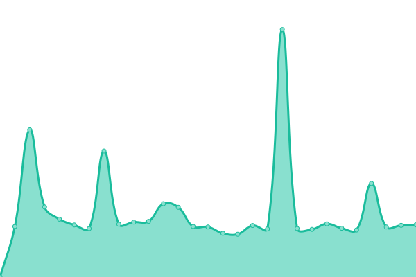

# [📈 Live Status](https://jpleasants.github.io/plesk8): <!--live status--> **🟧 Partial outage**

This repository contains the open-source uptime monitor and status page for [jpleasants](https://jpleasants.github.io/plesk8), powered by [Upptime](https://github.com/upptime/upptime).

With [Upptime](https://upptime.js.org), you can get your own unlimited and free uptime monitor and status page, powered entirely by a GitHub repository. We use [Issues](https://github.com/jpleasants/plesk8/issues) as incident reports, [Actions](https://github.com/jpleasants/plesk8/actions) as uptime monitors, and [Pages](https://jpleasants.github.io/plesk8) for the status page.

<!--start: status pages-->
<!-- This summary is generated by Upptime (https://github.com/upptime/upptime) -->
<!-- Do not edit this manually, your changes will be overwritten -->
<!-- prettier-ignore -->
| URL | Status | History | Response Time | Uptime |
| --- | ------ | ------- | ------------- | ------ |
|  [Plesk 8](https://plesk8.samitsolutions.com) | 🟩 Up | [plesk-8.yml](https://github.com/jpleasants/plesk8/commits/HEAD/history/plesk-8.yml) | 

 820ms
     
 | 

<a href="https://jpleasants.github.io/plesk8/history/plesk-8">100.00%</a>
    

|  [Africancarib Beanmarket](https://africancaribbeanmarket.com) | 🟩 Up | [africancarib-beanmarket.yml](https://github.com/jpleasants/plesk8/commits/HEAD/history/africancarib-beanmarket.yml) | 

 112ms
     
 | 

<a href="https://jpleasants.github.io/plesk8/history/africancarib-beanmarket">100.00%</a>
    

|  [Shah and Associates FP Portal](https://portal.shahandassociatesfp.com) | 🟩 Up | [shah-and-associates-fp-portal.yml](https://github.com/jpleasants/plesk8/commits/HEAD/history/shah-and-associates-fp-portal.yml) | 

 101ms
     
 | 

<a href="https://jpleasants.github.io/plesk8/history/shah-and-associates-fp-portal">100.00%</a>
    

|  [The Bright Five Venture](https://thebrightfiveventure.com) | 🟩 Up | [the-bright-five-venture.yml](https://github.com/jpleasants/plesk8/commits/HEAD/history/the-bright-five-venture.yml) | 

 105ms
     
 | 

<a href="https://jpleasants.github.io/plesk8/history/the-bright-five-venture">100.00%</a>
    

|  [Azitra Us](https://azitra.us) | 🟩 Up | [azitra-us.yml](https://github.com/jpleasants/plesk8/commits/HEAD/history/azitra-us.yml) | 

 992ms
     
 | 

<a href="https://jpleasants.github.io/plesk8/history/azitra-us">100.00%</a>
    

|  [Sixth Sense HI](https://sixthsensehi.com) | 🟩 Up | [sixth-sense-hi.yml](https://github.com/jpleasants/plesk8/commits/HEAD/history/sixth-sense-hi.yml) | 

 105ms
     
 | 

<a href="https://jpleasants.github.io/plesk8/history/sixth-sense-hi">100.00%</a>
    

|  [TripleR](https://tripler.com) | 🟩 Up | [triple-r.yml](https://github.com/jpleasants/plesk8/commits/HEAD/history/triple-r.yml) | 

 573ms
     
 | 

<a href="https://jpleasants.github.io/plesk8/history/triple-r">100.00%</a>
    

|  [Nukkad USA](https://nukkadusa.com) | 🟩 Up | [nukkad-usa.yml](https://github.com/jpleasants/plesk8/commits/HEAD/history/nukkad-usa.yml) | 

 87ms
     
 | 

<a href="https://jpleasants.github.io/plesk8/history/nukkad-usa">100.00%</a>
    

|  [Modern Closets and Doors](https://modernclosetsanddoors.com) | 🟥 Down | [modern-closets-and-doors.yml](https://github.com/jpleasants/plesk8/commits/HEAD/history/modern-closets-and-doors.yml) | 

 0ms
     
 | 

<a href="https://jpleasants.github.io/plesk8/history/modern-closets-and-doors">0.00%</a>
    

|  [Our Health Partner](https://ourhealthpartner.com) | 🟩 Up | [our-health-partner.yml](https://github.com/jpleasants/plesk8/commits/HEAD/history/our-health-partner.yml) | 

 101ms
     
 | 

<a href="https://jpleasants.github.io/plesk8/history/our-health-partner">100.00%</a>
    

|  [Vascular Wellness](https://vascularwellness.com) | 🟩 Up | [vascular-wellness.yml](https://github.com/jpleasants/plesk8/commits/HEAD/history/vascular-wellness.yml) | 

 91ms
     
 | 

<a href="https://jpleasants.github.io/plesk8/history/vascular-wellness">100.00%</a>
    

|  [rangoli Catering](https://rangolicatering.com) | 🟩 Up | [rangoli-catering.yml](https://github.com/jpleasants/plesk8/commits/HEAD/history/rangoli-catering.yml) | 

 104ms
     
 | 

<a href="https://jpleasants.github.io/plesk8/history/rangoli-catering">100.00%</a>
    

|  [Tandoori RTP](https://Tandoorinrtp.com) | 🟩 Up | [tandoori-rtp.yml](https://github.com/jpleasants/plesk8/commits/HEAD/history/tandoori-rtp.yml) | 

 118ms
     
 | 

<a href="https://jpleasants.github.io/plesk8/history/tandoori-rtp">100.00%</a>
    

|  [triangl Ehearing](https://trianglehearing.com) | 🟩 Up | [triangl-ehearing.yml](https://github.com/jpleasants/plesk8/commits/HEAD/history/triangl-ehearing.yml) | 

 101ms
     
 | 

<a href="https://jpleasants.github.io/plesk8/history/triangl-ehearing">100.00%</a>
    

|  [Synapse-ic](https://synapse-ic.com) | 🟩 Up | [synapse-ic.yml](https://github.com/jpleasants/plesk8/commits/HEAD/history/synapse-ic.yml) | 

 870ms
     
 | 

<a href="https://jpleasants.github.io/plesk8/history/synapse-ic">100.00%</a>
    

|  [Gardenroad Distributors](https://gardenroaddistributors.com) | 🟩 Up | [gardenroad-distributors.yml](https://github.com/jpleasants/plesk8/commits/HEAD/history/gardenroad-distributors.yml) | 

 102ms
     
 | 

<a href="https://jpleasants.github.io/plesk8/history/gardenroad-distributors">100.00%</a>
    

|  [The Rangoli Restaurant](https://therangolirestaurant.com) | 🟩 Up | [the-rangoli-restaurant.yml](https://github.com/jpleasants/plesk8/commits/HEAD/history/the-rangoli-restaurant.yml) | 

 97ms
     
 | 

<a href="https://jpleasants.github.io/plesk8/history/the-rangoli-restaurant">100.00%</a>
    

|  [The Airgap](https://theairgap.com) | 🟩 Up | [the-airgap.yml](https://github.com/jpleasants/plesk8/commits/HEAD/history/the-airgap.yml) | 

 510ms
     
 | 

<a href="https://jpleasants.github.io/plesk8/history/the-airgap">100.00%</a>
    

|  [Tandoori Bites](https://tandooribites.net) | 🟩 Up | [tandoori-bites.yml](https://github.com/jpleasants/plesk8/commits/HEAD/history/tandoori-bites.yml) | 

 92ms
     
 | 

<a href="https://jpleasants.github.io/plesk8/history/tandoori-bites">100.00%</a>
    

|  [Wilson Digestive Diseases Center](https://wilsondigestivediseasescenter.com) | 🟩 Up | [wilson-digestive-diseases-center.yml](https://github.com/jpleasants/plesk8/commits/HEAD/history/wilson-digestive-diseases-center.yml) | 

 97ms
     
 | 

<a href="https://jpleasants.github.io/plesk8/history/wilson-digestive-diseases-center">100.00%</a>
    

|  [Beta Search](https://beta-search.com) | 🟩 Up | [beta-search.yml](https://github.com/jpleasants/plesk8/commits/HEAD/history/beta-search.yml) | 

 99ms
     
 | 

<a href="https://jpleasants.github.io/plesk8/history/beta-search">100.00%</a>
    

|  [Campussafety Products](https://campussafetyproducts.com) | 🟩 Up | [campussafety-products.yml](https://github.com/jpleasants/plesk8/commits/HEAD/history/campussafety-products.yml) | 

 99ms
     
 | 

<a href="https://jpleasants.github.io/plesk8/history/campussafety-products">100.00%</a>
    

|  [Carolinas Tie](https://tiecarolinas.org) | 🟥 Down | [carolinas-tie.yml](https://github.com/jpleasants/plesk8/commits/HEAD/history/carolinas-tie.yml) | 

 1104ms
     
 | 

<a href="https://jpleasants.github.io/plesk8/history/carolinas-tie">99.99%</a>
    

|  [Midwest Sleep Medicine](https://midwestsleepmedicine.com) | 🟩 Up | [midwest-sleep-medicine.yml](https://github.com/jpleasants/plesk8/commits/HEAD/history/midwest-sleep-medicine.yml) | 

 125ms
     
 | 

<a href="https://jpleasants.github.io/plesk8/history/midwest-sleep-medicine">100.00%</a>
    

|  [Carolinas Tie](https://carolinas.tie.org) | 🟥 Down | [carolinas-tie.yml](https://github.com/jpleasants/plesk8/commits/HEAD/history/carolinas-tie.yml) | 

 1104ms
     
 | 

<a href="https://jpleasants.github.io/plesk8/history/carolinas-tie">99.99%</a>
    

|  [Executive eatsnyc](https://executiveeatsnyc.com) | 🟩 Up | [executive-eatsnyc.yml](https://github.com/jpleasants/plesk8/commits/HEAD/history/executive-eatsnyc.yml) | 

 130ms
     
 | 

<a href="https://jpleasants.github.io/plesk8/history/executive-eatsnyc">100.00%</a>
    

<!--end: status pages-->

[**Visit our status website →**](https://jpleasants.github.io/plesk8)

## 📄 License

- Powered by: [Upptime](https://github.com/upptime/upptime)
- Code: [MIT](./LICENSE) © [jpleasants](https://jpleasants.github.io/plesk8)
- Data in the `./history` directory: [Open Database License](https://opendatacommons.org/licenses/odbl/1-0/)
