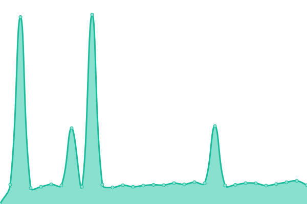

# [📈 Live Status](https://jpleasants.github.io/plesk8): <!--live status--> **🟧 Partial outage**

This repository contains the open-source uptime monitor and status page for [jpleasants](https://jpleasants.github.io/plesk8), powered by [Upptime](https://github.com/upptime/upptime).

With [Upptime](https://upptime.js.org), you can get your own unlimited and free uptime monitor and status page, powered entirely by a GitHub repository. We use [Issues](https://github.com/jpleasants/plesk8/issues) as incident reports, [Actions](https://github.com/jpleasants/plesk8/actions) as uptime monitors, and [Pages](https://jpleasants.github.io/plesk8) for the status page.

<!--start: status pages-->
<!-- This summary is generated by Upptime (https://github.com/upptime/upptime) -->
<!-- Do not edit this manually, your changes will be overwritten -->
<!-- prettier-ignore -->
| URL | Status | History | Response Time | Uptime |
| --- | ------ | ------- | ------------- | ------ |
|  [Plesk 8](https://plesk8.samitsolutions.com) | 🟥 Down | [plesk-8.yml](https://github.com/jpleasants/plesk8/commits/HEAD/history/plesk-8.yml) | 

 573ms
     
 | 

<a href="https://jpleasants.github.io/plesk8/history/plesk-8">75.46%</a>
    

|  [beta-search](https://beta-search.com) | 🟥 Down | [beta-search.yml](https://github.com/jpleasants/plesk8/commits/HEAD/history/beta-search.yml) | 

 590ms
     
 | 

<a href="https://jpleasants.github.io/plesk8/history/beta-search">92.63%</a>
    

|  [executiveeatsnyc](https://executiveeatsnyc.com) | 🟩 Up | [executiveeatsnyc.yml](https://github.com/jpleasants/plesk8/commits/HEAD/history/executiveeatsnyc.yml) | 

 582ms
     
 | 

<a href="https://jpleasants.github.io/plesk8/history/executiveeatsnyc">72.69%</a>
    

|  [gardenroaddistributors](https://gardenroaddistributors.com) | 🟥 Down | [gardenroaddistributors.yml](https://github.com/jpleasants/plesk8/commits/HEAD/history/gardenroaddistributors.yml) | 

 489ms
     
 | 

<a href="https://jpleasants.github.io/plesk8/history/gardenroaddistributors">74.31%</a>
    

|  [midwestsleepmedicine](https://midwestsleepmedicine.com) | 🟩 Up | [midwestsleepmedicine.yml](https://github.com/jpleasants/plesk8/commits/HEAD/history/midwestsleepmedicine.yml) | 

 462ms
     
 | 

<a href="https://jpleasants.github.io/plesk8/history/midwestsleepmedicine">92.89%</a>
    

|  [Sixth Sense HI](https://sixthsensehi.com) | 🟩 Up | [sixth-sense-hi.yml](https://github.com/jpleasants/plesk8/commits/HEAD/history/sixth-sense-hi.yml) | 

 611ms
     
 | 

<a href="https://jpleasants.github.io/plesk8/history/sixth-sense-hi">68.40%</a>
    

|  [ourhealthpartner](https://ourhealthpartner.com) | 🟩 Up | [ourhealthpartner.yml](https://github.com/jpleasants/plesk8/commits/HEAD/history/ourhealthpartner.yml) | 

 1699ms
     
 | 

<a href="https://jpleasants.github.io/plesk8/history/ourhealthpartner">93.59%</a>
    

|  [rangolicatering](https://rangolicatering.com) | 🟥 Down | [rangolicatering.yml](https://github.com/jpleasants/plesk8/commits/HEAD/history/rangolicatering.yml) | 

 449ms
     
 | 

<a href="https://jpleasants.github.io/plesk8/history/rangolicatering">72.28%</a>
    

|  [tandoorinrtp](https://tandoorinrtp.com) | 🟥 Down | [tandoorinrtp.yml](https://github.com/jpleasants/plesk8/commits/HEAD/history/tandoorinrtp.yml) | 

 2328ms
     
 | 

<a href="https://jpleasants.github.io/plesk8/history/tandoorinrtp">70.43%</a>
    

|  [thebrightfiveventure](https://thebrightfiveventure.com) | 🟩 Up | [thebrightfiveventure.yml](https://github.com/jpleasants/plesk8/commits/HEAD/history/thebrightfiveventure.yml) | 

 516ms
     
 | 

<a href="https://jpleasants.github.io/plesk8/history/thebrightfiveventure">70.28%</a>
    

|  [therangolirestaurant](https://therangolirestaurant.com) | 🟩 Up | [therangolirestaurant.yml](https://github.com/jpleasants/plesk8/commits/HEAD/history/therangolirestaurant.yml) | 

 549ms
     
 | 

<a href="https://jpleasants.github.io/plesk8/history/therangolirestaurant">93.91%</a>
    

|  [wilsondigestivediseasescenter](https://wilsondigestivediseasescenter.com) | 🟩 Up | [wilsondigestivediseasescenter.yml](https://github.com/jpleasants/plesk8/commits/HEAD/history/wilsondigestivediseasescenter.yml) | 

 1067ms
     
 | 

<a href="https://jpleasants.github.io/plesk8/history/wilsondigestivediseasescenter">85.22%</a>
    

|  [theairgap](https://theairgap.com) | 🟩 Up | [theairgap.yml](https://github.com/jpleasants/plesk8/commits/HEAD/history/theairgap.yml) | 

 728ms
     
 | 

<a href="https://jpleasants.github.io/plesk8/history/theairgap">93.82%</a>
    

|  [triangl Ehearing](https://trianglehearing.com) | 🟩 Up | [triangl-ehearing.yml](https://github.com/jpleasants/plesk8/commits/HEAD/history/triangl-ehearing.yml) | 

 2388ms
     
 | 

<a href="https://jpleasants.github.io/plesk8/history/triangl-ehearing">93.86%</a>
    

|  [nukkadusa](https://nukkadusa.com) | 🟩 Up | [nukkadusa.yml](https://github.com/jpleasants/plesk8/commits/HEAD/history/nukkadusa.yml) | 

 581ms
     
 | 

<a href="https://jpleasants.github.io/plesk8/history/nukkadusa">71.21%</a>
    

|  [synapse](https://synapse-ic.com) | 🟩 Up | [synapse.yml](https://github.com/jpleasants/plesk8/commits/HEAD/history/synapse.yml) | 

 938ms
     
 | 

<a href="https://jpleasants.github.io/plesk8/history/synapse">93.86%</a>
    

|  [tripler](https://tripler.com) | 🟩 Up | [tripler.yml](https://github.com/jpleasants/plesk8/commits/HEAD/history/tripler.yml) | 

 2742ms
     
 | 

<a href="https://jpleasants.github.io/plesk8/history/tripler">94.04%</a>
    

|  [doorworkscompany](https://doorworkscompany.com) | 🟩 Up | [doorworkscompany.yml](https://github.com/jpleasants/plesk8/commits/HEAD/history/doorworkscompany.yml) | 

 866ms
     
 | 

<a href="https://jpleasants.github.io/plesk8/history/doorworkscompany">92.47%</a>
    

|  [originhubs](https://originhubs.com) | 🟥 Down | [originhubs.yml](https://github.com/jpleasants/plesk8/commits/HEAD/history/originhubs.yml) | 

 2295ms
     
 | 

<a href="https://jpleasants.github.io/plesk8/history/originhubs">51.11%</a>
    

|  [launchmorrisville](https://launchmorrisville.org) | 🟩 Up | [launchmorrisville.yml](https://github.com/jpleasants/plesk8/commits/HEAD/history/launchmorrisville.yml) | 

 1142ms
     
 | 

<a href="https://jpleasants.github.io/plesk8/history/launchmorrisville">70.33%</a>
    

|  [carolinamedicalcare](https://carolinamedicalcare.com) | 🟩 Up | [carolinamedicalcare.yml](https://github.com/jpleasants/plesk8/commits/HEAD/history/carolinamedicalcare.yml) | 

 1015ms
     
 | 

<a href="https://jpleasants.github.io/plesk8/history/carolinamedicalcare">72.88%</a>
    

|  [ncspices](https://ncspices.com) | 🟩 Up | [ncspices.yml](https://github.com/jpleasants/plesk8/commits/HEAD/history/ncspices.yml) | 

 2528ms
     
 | 

<a href="https://jpleasants.github.io/plesk8/history/ncspices">93.36%</a>
    

|  [calltoresearch](https://calltoresearch.com) | 🟩 Up | [calltoresearch.yml](https://github.com/jpleasants/plesk8/commits/HEAD/history/calltoresearch.yml) | 

 1900ms
     
 | 

<a href="https://jpleasants.github.io/plesk8/history/calltoresearch">94.23%</a>
    

|  [techlogyx](https://techlogyx.com) | 🟩 Up | [techlogyx.yml](https://github.com/jpleasants/plesk8/commits/HEAD/history/techlogyx.yml) | 

 4366ms
     
 | 

<a href="https://jpleasants.github.io/plesk8/history/techlogyx">94.26%</a>
    

|  [tiecarolinas](https://tiecarolinas.org) | 🟩 Up | [tiecarolinas.yml](https://github.com/jpleasants/plesk8/commits/HEAD/history/tiecarolinas.yml) | 

 1114ms
     
 | 

<a href="https://jpleasants.github.io/plesk8/history/tiecarolinas">94.30%</a>
    

|  [raidentechgroup](https://raidentechgroup.com) | 🟩 Up | [raidentechgroup.yml](https://github.com/jpleasants/plesk8/commits/HEAD/history/raidentechgroup.yml) | 

 4728ms
     
 | 

<a href="https://jpleasants.github.io/plesk8/history/raidentechgroup">94.32%</a>
    

<!--end: status pages-->

[**Visit our status website →**](https://jpleasants.github.io/plesk8)

## 📄 License

- Powered by: [Upptime](https://github.com/upptime/upptime)
- Code: [MIT](./LICENSE) © [jpleasants](https://jpleasants.github.io/plesk8)
- Data in the `./history` directory: [Open Database License](https://opendatacommons.org/licenses/odbl/1-0/)
